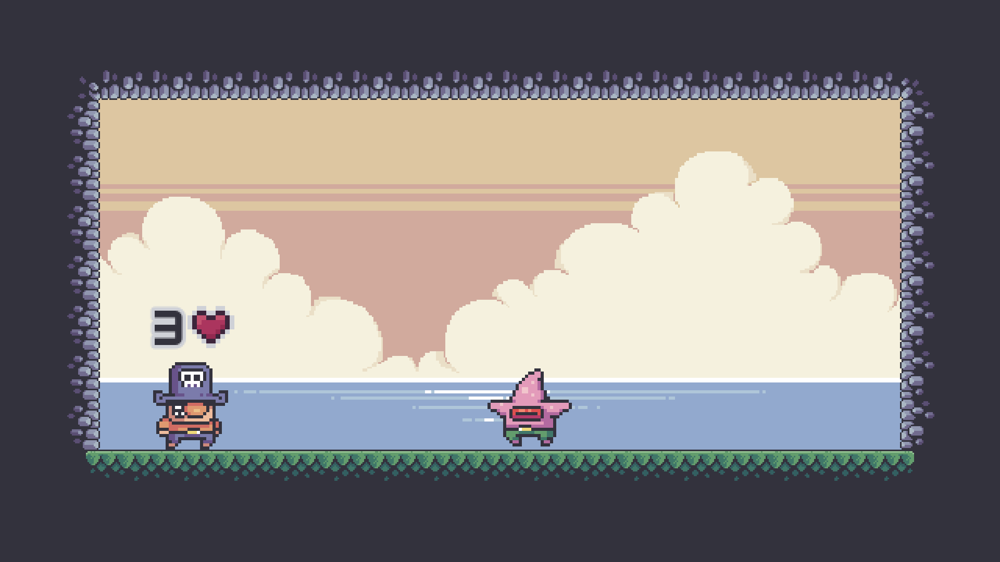
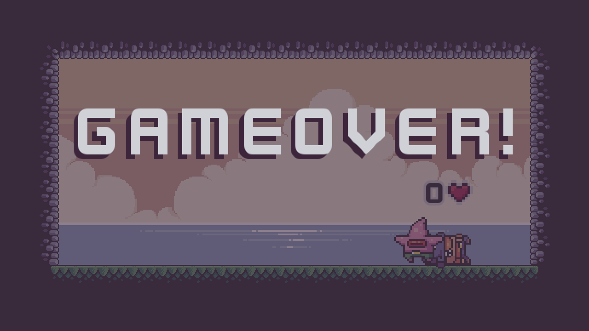

# Código Maestro: El desafío de los bits
## Ejercicio 2: Sistema de Vidas en un Juego de Plataformas

Este proyecto presenta una solución básica para implementar un sistema de vidas en un juego de plataformas utilizando **Godot 4.3**. La lógica de este ejercicio permite que el jugador disponga de 3 vidas al inicio del juego. Cada vez que colisiona con un enemigo, pierde una vida. Si las vidas llegan a 0, el juego muestra un mensaje de "Game Over".

El trabajo de programación y la lógica fue realizado por **David Betancourt Naranjo**, mientras que la música y los efectos de sonido (SFX) fueron creados por **Diego Reyes Beltrán**.

## Integrantes de Team MABATO
- **David Betancourt Naranjo** (ddavebet)
- **Jonathan Nuo Echeverría** (nuomation)
- **Diego Reyes Beltrán** (diegoreyesdarmusica)

## Acceso en Itch.io
Este ejercicio también está disponible en [Itch.io en este enlace](https://ddavebet.itch.io/ejercicio-postulacion) para facilitar su visualización y prueba.

## Créditos adicionales
* **Sprites:**
	* https://pixelfrog-assets.itch.io/treasure-hunters
	* https://kenney.nl/assets/input-prompts
* **Fuentes:**
	* https://kenney.nl/assets/kenney-fonts
	* https://www.dafont.com/es/minecraft.font

## Captura de pantalla

